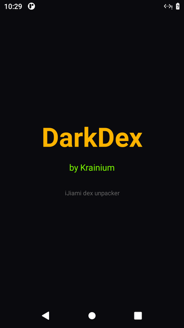
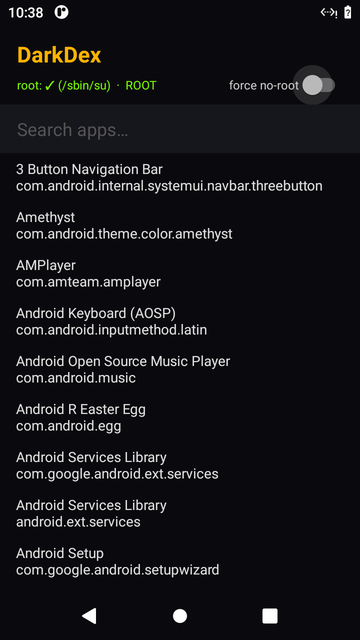
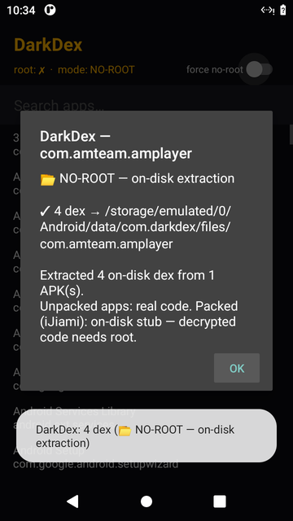
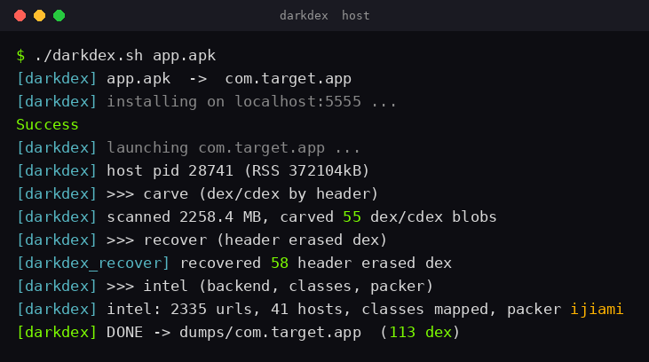

# 🟣 DarkDex

> ⚡ powerful tool to bypass ijiami 4th gen.

🧬 DarkDex pulls the real dex out of packed android apps. it reads the running app memory and rebuilds the dex even when the header is wiped, so it works on ijiami including the 4th gen vmp, other packers, and plain apps too.

it comes in two parts.

🖥️ darkdex.sh runs on a redroid host. it reads the target process memory from outside the android sandbox, so nothing inside the app can spot it.

📱 darkdex.apk runs on the phone or emulator itself. root mode does a full memory dump. no root mode pulls the on disk dex.

## 🆕 v2: event driven capture

v1 took one memory snapshot. v2 adds four things, all still from **outside** the sandbox (invisible to ijiami anti debug). full writeup in [V2.md](V2.md).

- ⚡ **release tracer** (`native/darkdex_trace.bt` + `darkdex_grab`). kernel probes (bpftrace uprobes) on ART's `DexFileLoader::OpenCommon` and `ClassLinker::DefineClass`. grabs every decrypted dex the instant ART opens it, **before the header gets wiped**, across the packer's **respawns**, plus a live class map. against real ijiami 4th gen this pulled the app dex at **9,605 classes** and baksmali disassembled all of it clean.
- 🧭 **artwalk** (`darkdex_artwalk`). recovers dex from live `art::DexFile` heap objects (exact `begin_/size_`) even when the header **and** map_list are wiped.
- 🧩 **real cdex to dex** (`cdex_to_dex`). expands CompactDex code items to standard layout so dumps actually decompile (v1 only stamped the magic).
- ✅ **dexval** (`host/dexval.py`). validates, dedups, ranks, and smoke tests disassembly. winners land in `dumps/<pkg>/best/`.

one shot: `./host/darkdex.sh com.some.app --baksmali`  (needs `bpftrace` on the host).

## 📥 setup

clone it

```
git clone https://github.com/Krainium/DarkDex.git
cd DarkDex
```

### 🖥️ host tool (darkdex.sh)

you need a linux host running redroid, which is android inside docker. use the arm64 image so it runs arm apps. the host kernel needs the binder modules.

load binder on the host

```
sudo modprobe binder_linux devices="binder,hwbinder,vndbinder"
```

start redroid and connect adb

```
docker run -itd --privileged --name redroid \
  -v ~/redroid_data:/data -p 5555:5555 \
  redroid/redroid:11.0.0 \
  androidboot.redroid_width=720 androidboot.redroid_height=1280
adb connect localhost:5555
```

build the native cores on the host

```
cd native
g++ -O2 -std=c++17 -o darkdex_carve   darkdex_carve.cpp
g++ -O2 -std=c++17 -o darkdex_recover darkdex_recover.cpp
g++ -O2 -std=c++17 -o darkdex_intel   darkdex_intel.cpp
cd ..
```

run it. pass an apk and it installs it for you, or pass a package that is already installed.

```
./host/darkdex.sh app.apk
./host/darkdex.sh com.some.app
```

dumps land in dumps/<package>/ with the carved dex, the recovered dex, and an intel file with the backend urls, the class map and the packer id.

### 📱 the app (darkdex.apk)

grab the apk from the releases page and install it

```
adb install -r -g darkdex.apk
```

or build it yourself

```
cd app
./gradlew :app:assembleDebug
adb install -r -g app/build/outputs/apk/debug/app-debug.apk
```

open DarkDex, pick an app from the list, and it dumps. on a rooted device or emulator the badge turns green and you get the full memory dump. without root it pulls the on disk dex. there is a search box and a force no root switch.

## 🔧 how it works

the full writeup is in ijiami.md.

## 📸 screens

✨ splash



📲 app with the root badge, search box and toggle



🧩 dump result with the mode badge



💻 a dump running in the terminal



## 🎓 for educational use

> for research and learning.
